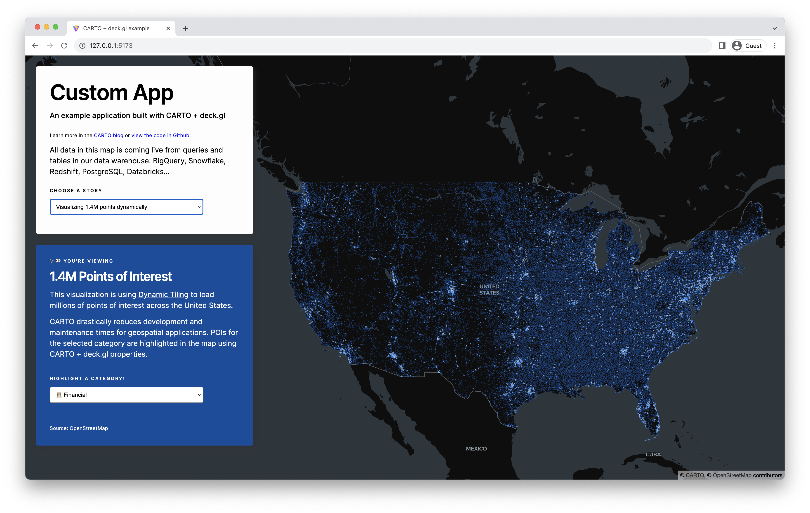

# Modernizing your geospatial apps in the cloud with CARTO



This repository contains a custom geospatial application built with [CARTO](https://carto.com) and [deck.gl](deck.gl). This application is an example of our modern approach to developing geospatial applications at scale, by leveraging the power of the leading cloud data warehouses (BigQuery, Snowflake, Redshift, Databricks...) with the flexibility and performance of deck.gl.

You can read the full story in our blogpost «[Modernizing your geospatial apps in the cloud with CARTO](https://carto.com/blog)»

## Running this example

You can run this example application in your browser using

```bash
npm install
npm run dev
```

